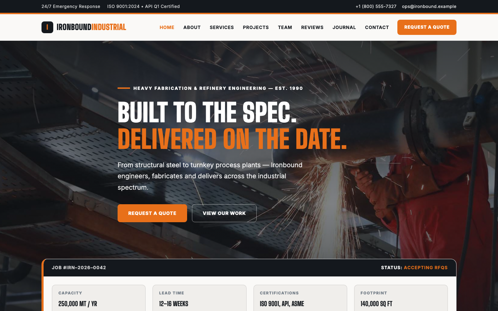

# Ironbound Industrial — Heavy Fabrication & Refinery Engineering Template

A premium, framework-free HTML template for an industrial engineering and fabrication firm. Charcoal graphite grounds with safety amber accents, concrete and steel surfaces, driven by Big Shoulders Display type and Inter body text — a heavy, confident presence for a shop that has been welding since 1990.

## 📸 Screenshot

## Design System

| Token | Value |
|-------|-------|
| **Ground** | `--clr-ink` `#14181d` (charcoal), `--clr-concrete` `#f0eeeb` (light), `--clr-dark` `#101318` (dark) |
| **Primary** | `--clr-amber` `#e8701a` (safety amber) |
| **Neutral** | `--clr-steel` `#b8bec4`, `--clr-graphite` `#2a2f35` |
| **Text** | `--clr-body` `#3a4048`, `--clr-light` `#f5f4f1`, `--clr-muted` `#8a929b` |
| **Display type** | `Big Shoulders Display` (900, uppercase) |
| **Body type** | `Inter` (sans, 400–800) |
| **Container** | 1200px max-width, centered |
| **Breakpoints** | ~992px (grid collapse), ~576px (single column) |

## Pages

| Page | File | Description |
|------|------|-------------|
| Home | [index.html](index.html) | Hero with crossfading plant photography, job-ticket quote card, certification strip, six service cards, stats, five-step process, bento project grid, testimonials, field notes, CTA |
| About | [about.html](about.html) | Company story since 1990, stats band, values, CTA |
| Services | [service.html](service.html) | Six numbered capability cards, five-step delivery process on dark |
| Projects | [project.html](project.html) | Bento project grid with overlay tags, project stats |
| Our Team | [team.html](team.html) | Four leadership cards, dark recruiting split |
| Testimonials | [testimonial.html](testimonial.html) | Six client testimonials, satisfaction stats |
| Field Notes | [blog.html](blog.html) | Six technical posts on fabrication, welding and safety |
| Contact | [contact.html](contact.html) | Contact form with `[data-form]` validation, info cards, map frame |
| Quote | [quote.html](quote.html) | RFQ form with project type/budget/timeline selectors |
| 404 | [404.html](404.html) | On-brand error page with recovery links |

## Features

- **Framework-free** — pure HTML5, CSS3 (custom properties, Grid, Flexbox, `clamp()`), vanilla JavaScript
- **Industrial editorial aesthetic** — charcoal + safety amber + concrete, hazard-stripe accents, uppercase display type
- **Hazard-stripe motifs** — `repeating-linear-gradient(45deg, …)` stripes on the topbar, page banners and CTA section
- **Fluid responsive** — two breakpoints, no horizontal scroll on any viewport
- **Scroll reveal** — IntersectionObserver-powered `.reveal` animations (respects `prefers-reduced-motion`)
- **Mobile nav** — burger toggle with `aria-expanded` accessible pattern
- **Hero crossfade** — automatic 6s background image transition via `.hero-bg img` + `.active`
- **Job-ticket card** — overlapping hero quote card with reference, status, capacity, lead time, certifications and footprint fields
- **Certification strip** — ISO 9001, API Q1, ASME Section VIII, AWS, NACE, CWI badge row
- **Service cards** — numbered spec-sheet style cards with icon and link
- **Process timeline** — five-step shift-handover sequence on dark ground
- **Bento project grid** — mixed-aspect photo tiles with overlay tags and links
- **Testimonial cards** — avatar, role and client quote
- **Blog grid** — post cards with category, image and teaser
- **Contact form** — `[data-form]` hook with `.form-ok` / `.form-err` / `.show` toggle
- **RFQ form** — `[data-form]` validation with project type, budget and timeline selectors
- **Newsletter** — footer sign-up form with validation feedback
- **Original imagery** — production shop, refinery and pipeline photography, no placeholders

## Tech Stack

- HTML5 + CSS3 (W3C-valid, semantic landmarks)
- Vanilla JavaScript (canonical IIFE build)
- Google Fonts (Big Shoulders Display + Inter)
- SVG favicon (inline data: URI)

## SEO

- Semantic HTML5 structure (`<header>`, `<nav>`, `<main>`, `<section>`, `<footer>`)
- Unique `<title>` and `<meta description>` per page
- `lang="en"` attribute, `charset="utf-8"`, viewport meta
- Alt text on all images

## License

Free for personal and commercial use. Attribution appreciated but not required.

---

## Let's Build Something Together 🚀

[Book a free consultation](https://tally.so/r/q4q1L9)
